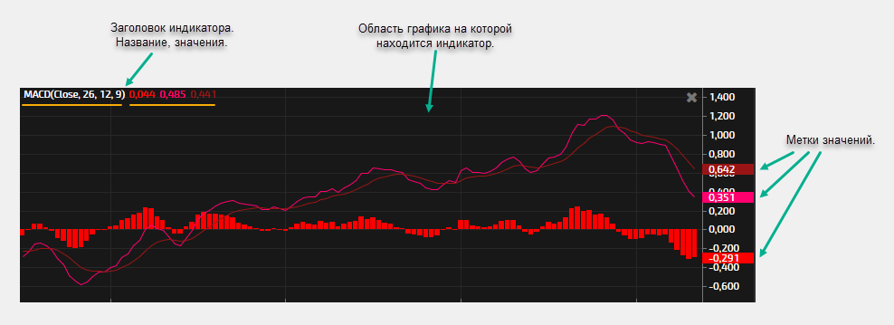

# IndicatorBase

`namespace` [TigerTrade.Chart](../../../).[Indicators](../../Indicators.md).[Common](../Common.md)

Базовый класс для создания индикаторов.

<figure><figcaption></figcaption></figure>

<figure><figcaption></figcaption></figure>

### Синтаксис

```csharp
public abstract class IndicatorBase : INotifyPropertyChanged, IDynamicProperty
```

### Методы

| Название                                                                                  | Описание   |
| ----------------------------------------------------------------------------------------- | ---------- |
| [`AddAlert`](IndicatorBase.cs/Методы/AddAlert.md)                                         | _Описание_ |
| [`ApplyColors`](IndicatorBase.cs/Методы/ApplyColors.md)                                   | _Описание_ |
| [`CheckNeedRedraw`](IndicatorBase.cs/Методы/CheckNeedRedraw.md)                           | _Описание_ |
| [`CopyTemplate`](IndicatorBase.cs/Методы/CopyTemplate.md)                                 | _Описание_ |
| [`Execute`](IndicatorBase.cs/Методы/Execute.md)                                           | _Описание_ |
| [`GetAlerts`](IndicatorBase.cs/Методы/GetAlerts.md)                                       | _Описание_ |
| [`GetDistance`](IndicatorBase.cs/Методы/GetDistance.md)                                   | _Описание_ |
| [`GetLabels`](IndicatorBase.cs/Методы/GetLabels.md)                                       | _Описание_ |
| [`GetMinMax`](IndicatorBase.cs/Методы/GetMinMax.md)                                       | _Описание_ |
| [`GetPoints`](IndicatorBase.cs/Методы/GetPoints.md)                                       | _Описание_ |
| [`GetPropertyHasStandardValues`](IndicatorBase.cs/Методы/GetPropertyHasStandardValues.md) | _Описание_ |
| [`GetPropertyReadOnly`](IndicatorBase.cs/Методы/GetPropertyReadOnly.md)                   | _Описание_ |
| [`GetPropertyStandardValues`](IndicatorBase.cs/Методы/GetPropertyStandardValues.md)       | _Описание_ |
| [`GetPropertyVisibility`](IndicatorBase.cs/Методы/GetPropertyVisibility.md)               | _Описание_ |
| [`GetTitle`](IndicatorBase.cs/Методы/GetTitle.md)                                         | _Описание_ |
| [`GetValues`](IndicatorBase.cs/Методы/GetValues.md)                                       | _Описание_ |
| [`GetX`](IndicatorBase.cs/Методы/GetX.md)                                                 | _Описание_ |
| [`GetY`](IndicatorBase.cs/Методы/GetY.md)                                                 | _Описание_ |
| [`IndicatorBase`](IndicatorBase.cs/Методы/IndicatorBase.md)                               | _Описание_ |
| [`OnPropertyChanged`](IndicatorBase.cs/Методы/OnPropertyChanged.md)                       | _Описание_ |
| [`PropChanged`](IndicatorBase.cs/Методы/PropChanged.md)                                   | _Описание_ |
| [`Render`](IndicatorBase.cs/Методы/Render.md)                                             | _Описание_ |
| [`Run`](IndicatorBase.cs/Методы/Run.md)                                                   | _Описание_ |
| [`SetSettingsParam`](IndicatorBase.cs/Методы/SetSettingsParam.md)                         | _Описание_ |
| [`ToString`](IndicatorBase.cs/Методы/ToString.md)                                         | _Описание_ |

### Свойства

| Название                                                                            | Описание                                                                                               |
| ----------------------------------------------------------------------------------- | ------------------------------------------------------------------------------------------------------ |
| [`Calculation`](IndicatorBase.cs/Свойства/Calculation.md)                           | _Возвращает интервал пересчета индикатора._                                                            |
| [`Canvas`](IndicatorBase.cs/Свойства/Canvas.md)                                     | _Возвращает или задает объект для работы с отрисовкой области графика на которой находится индикатор._ |
| [`ChartDataType`](IndicatorBase.cs/Свойства/ChartDataType.md)                       | _Возвращает тип данных отображения цены._                                                              |
| [`ClearData`](IndicatorBase.cs/Свойства/ClearData.md)                               | _Возвращает необходимость очистки данных._                                                             |
| [`DataProvider`](IndicatorBase.cs/Свойства/DataProvider.md)                         | _Возвращает объект для работы с данными._                                                              |
| [`DefaultCalculation`](IndicatorBase.cs/Свойства/DefaultCalculation.md)             | _Возвращает интервал пересчета индикатора по умолчанию._                                               |
| [`DisableRender`](IndicatorBase.cs/Свойства/DisableRender.md)                       | _Возвращает или задает отключение отрисовки графической части индикатора._                             |
| [`Helper`](IndicatorBase.cs/Свойства/Helper.md)                                     | _Возвращает вспомогательный объект для работы с данными и встроенными индикаторами._                   |
| [`ID`](IndicatorBase.cs/Свойства/ID.md)                                             | _Возвращает ID заданное в атрибуте IndicatorAtribute._                                                 |
| [`IntegerValues`](IndicatorBase.cs/Свойства/IntegerValues.md)                       | _Возвращает являются ли значения индикатора целыми числами._                                           |
| [`IsStock`](IndicatorBase.cs/Свойства/IsStock.md)                                   | _Возвращает ???_                                                                                       |
| [`Levels`](IndicatorBase.cs/Свойства/Levels.md)                                     | _Возвращает или задает коллекцию_ ChartLevel.                                                          |
| [`Name`](IndicatorBase.cs/Свойства/Name.md)                                         | _Возвращает Name заданное в атрибуте IndicatorAtribute._                                               |
| [`Panel`](IndicatorBase.cs/Свойства/Panel.md)                                       | _Возвращает или задает имя области на которой находится индикатор._                                    |
| [`Panels`](IndicatorBase.cs/Свойства/Panels.md)                                     | Возвращает коллекцию имен областей на графике.                                                         |
| [`Series`](IndicatorBase.cs/Свойства/Series.md)                                     | Возвращает объект IndicatorSeries.                                                                     |
| [`SettingsLongKey`](IndicatorBase.cs/Свойства/SettingsLongKey.md)                   | Возвращает длинное имя данных: `тикер_тип_биржа_тип агрегации данных_значение агрегации данных`.       |
| [`SettingsShortKey`](IndicatorBase.cs/Свойства/SettingsShortKey.md)                 | Возвращает короткое имя данных: `тикер_тип_биржа`.                                                     |
| [`ShowIndicator`](IndicatorBase.cs/Свойства/ShowIndicator.md)                       | _Возвращает или задает отображать ли индикатор на графике._                                            |
| [`ShowIndicatorLabels`](IndicatorBase.cs/Свойства/ShowIndicatorLabels.md)           | _Возвращает или задает отображать ли маркеры значений индикатора на ценовой шкале._                    |
| [`ShowIndicatorLabelsParam`](IndicatorBase.cs/Свойства/ShowIndicatorLabelsParam.md) | _Возвращает или задает ???_                                                                            |
| [`ShowIndicatorParam`](IndicatorBase.cs/Свойства/ShowIndicatorParam.md)             | _Возвращает или задает ???_                                                                            |
| [`ShowIndicatorTitle`](IndicatorBase.cs/Свойства/ShowIndicatorTitle.md)             | _Возвращает или задает отображать ли название индикатора в заголовке индикатора._                      |
| [`ShowIndicatorTitleParam`](IndicatorBase.cs/Свойства/ShowIndicatorTitleParam.md)   | _Возвращает или задает ???_                                                                            |
| [`ShowIndicatorValues`](IndicatorBase.cs/Свойства/ShowIndicatorValues.md)           | _Возвращает или задает отображать ли значения индикатора в заголовке индикатора._                      |
| [`ShowIndicatorValuesParam`](IndicatorBase.cs/Свойства/ShowIndicatorValuesParam.md) | _Возвращает или задает ???_                                                                            |
| [`Title`](IndicatorBase.cs/Свойства/Title.md)                                       | Возвращает название которое отображается в заголовке и списке индикаторов добавленных в область.       |

### События

| Название                                                         | Описание                             |
| ---------------------------------------------------------------- | ------------------------------------ |
| [`PropertyChanged`](IndicatorBase.cs/События/PropertyChanged.md) | Событие изменения значения свойства. |

### Примеры

Минимально необходимый код для создания нового индикатора.

```csharp
[DataContract(Name = "VolumeIndicator", Namespace = "http://schemas.datacontract.org/2004/07/TigerTrade.Chart.Indicators.Custom")]
[Indicator("X_Volume", "*Volume", false, Type = typeof(VolumeIndicator))]
internal sealed class VolumeIndicator : IndicatorBase
{
	protected override void Execute()
	{
		throw new NotImplementedException();
	}
}
```

При создании производного класса от IndicatorBase необходимо добавить над объявлением класса два атрибута - DataContractAtribute и IndicatorAtribute.

Name в DataContractAtribute должно соответствовать названию класса.
